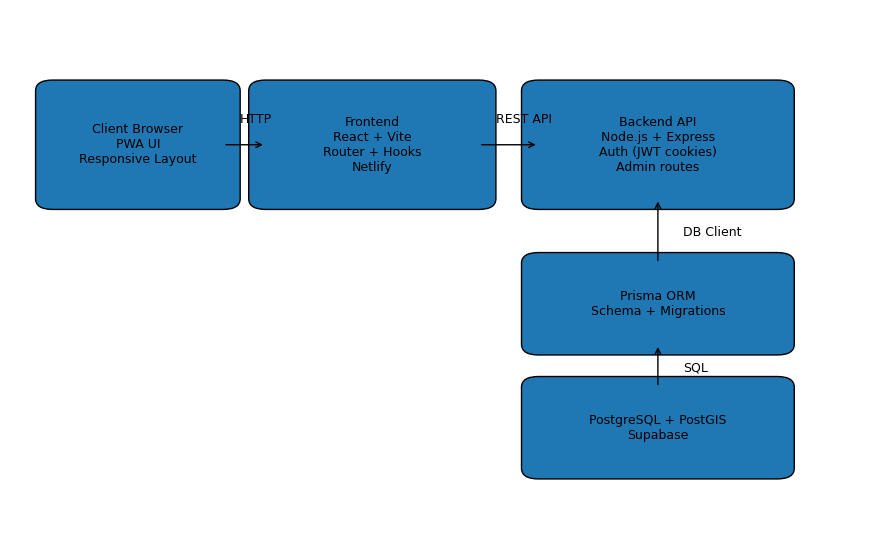

# PeakGuide

**PeakGuide** is a full-stack web application for exploring the **Crown of Polish Mountains (Korona Gór Polski)** and other mountain peaks.

This project was built as a **portfolio-grade MVP**, focusing on clean architecture, real API integration, multilingual support, and scalable backend design — similar to a production travel or outdoor platform.

---

## 🌍 Live Demo

[Frontend](https://peak-guide.netlify.app/)
[API](https://peakguide-api.onrender.com)

---

## 🎯 Project Purpose

PeakGuide was created to demonstrate:

- Full-stack architecture (React + Node + PostgreSQL)
- Real API integration (not mock data)
- Multilingual data handling (UI + database i18n)
- Admin-ready structure for content management
- Clean separation between application and server layers
- Testable backend architecture

The goal was to build something closer to a **real product** rather than just a UI demo.

---

## 🧱 Tech Stack

### Frontend

- React (Vite)
- React Router
- Custom hooks (`useAsync`, `useMediaQuery`)
- Responsive layout (mobile-first approach)
- Multilingual UI (PL / EN / UA / ZH)

### Backend

- Node.js
- Express
- REST API
- Cookie-based JWT authentication (role-based guards)

### Database

- PostgreSQL
- PostGIS (geographic data)
- Prisma ORM
- Normalized schema with i18n tables:
  - `peaks_i18n`
  - `mountain_ranges_i18n`

### Testing

- Vitest
- Supertest
- API smoke tests
- Separate test database configuration

### Deployment

- Render — API + PostgreSQL
- Netlify — Frontend

---

## ✨ Core Features (MVP)

### Public

- 🌍 Multilingual interface (PL / EN / UA / ZH – UI ready)
- ⛰️ Peaks list with filtering by range
- 🏔️ Mountain ranges list and details
- 📄 Detailed peak pages:
  - Description
  - Elevation
  - Range
  - Coordinates
  - Google Maps link
- 🧭 Breadcrumb navigation
- 📱 Fully responsive layout
- 🖼️ Language-based themed backgrounds

### Admin (API-ready structure)

- Role-based route guards
- Message management (archive / restore)
- User admin toggle
- Peaks CRUD (architecture prepared)

---

## 🧩 Architecture Overview

### Frontend

- Feature-based page structure
- API client layer separated from UI components
- Clean routing hierarchy (Peaks → Ranges → Details)

### Backend

- `app.js` → creates Express app (testable instance)
- `server.js` → starts server (production bootstrap)
- `db.js` → environment-aware DB configuration
- Route modules separated by responsibility
- Admin routes protected via middleware guards

This separation allows:

- Running tests without starting a real server
- Safer test database isolation
- Cleaner production deployment

---

## 🏗️ Project Structure (Simplified)

- peakguide_front/ # React client
- peakguide_api/ # Node / Express API
- docs/
- screenshots/
- architecture/

---

## 📸 Screenshots

> Store screenshots inside:

- Frontend

```md


```

- API - backend

```md


```

## 🧩 Architecture Overview



---

## 🛣️ Planned Extensions

- 🥾 Hiking routes & trailheads

- 🗺️ GPX track support

- ⏱️ Estimated hiking time

- ⭐ User progress tracking

- 🔐 Full authentication system

- 🛠️ Admin panel UI

The current architecture is intentionally built to support these future features.

---

## 🧠 What I Learned

- Structuring a testable Express backend (app vs server separation)

- Designing safer database configuration for test environments

- Implementing role-based authorization (admin guards)

- Working with PostgreSQL + Prisma + geographic data

- Managing multilingual content via normalized schema

- Building a portfolio project that mirrors real-world production patterns

---

## 📌 Status

MVP Complete — actively expanding

The core browsing experience is complete and stable.
Next milestones focus on routes, trailheads, and user progress.

---

## 👨‍💻 Author

- Przemysław Pietkun
- Frontend / Full-Stack Developer Portfolio Project

---
