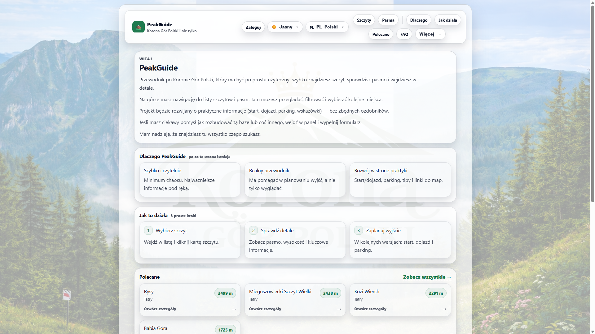
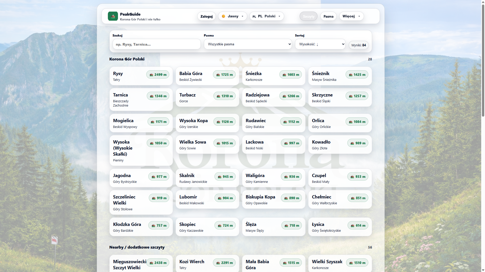
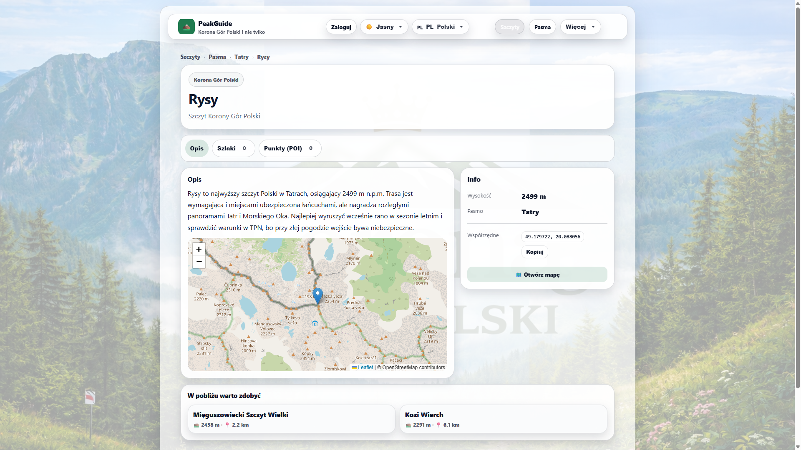
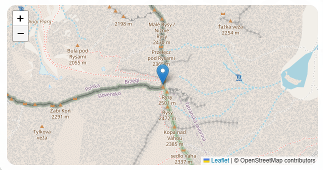
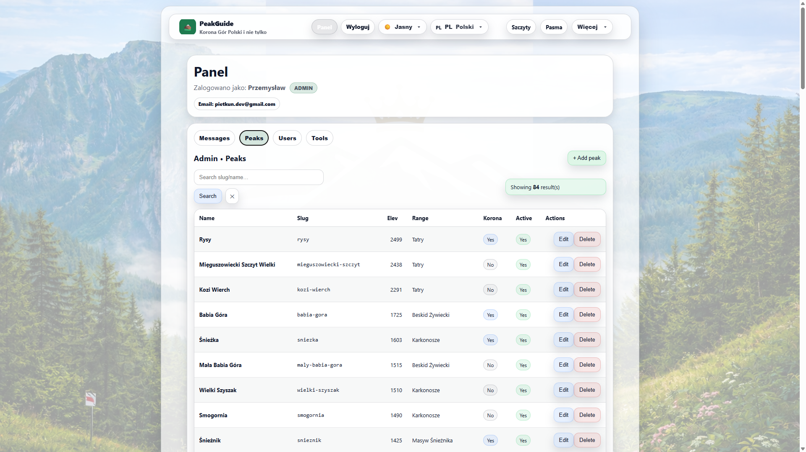
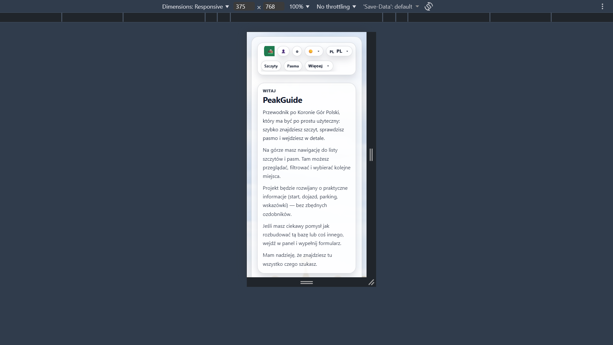
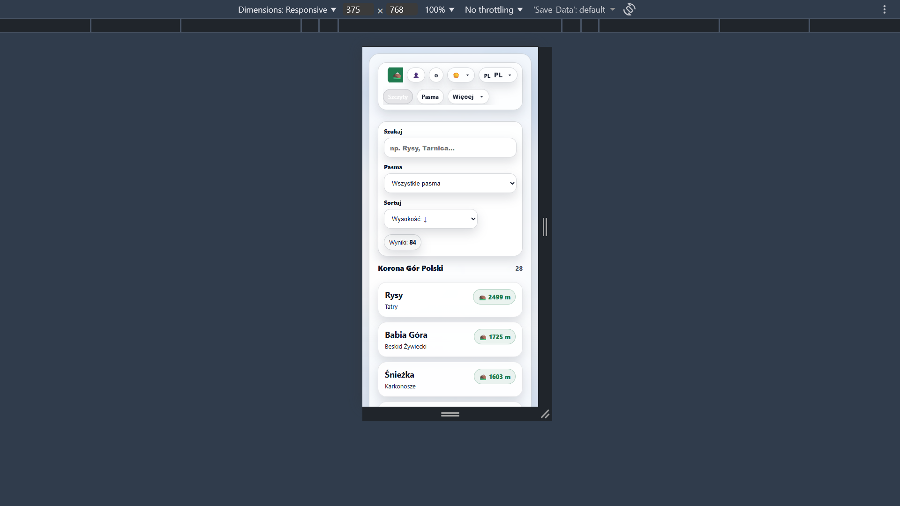

# PeakGuide — Frontend

This is the **React frontend** for the PeakGuide application.

PeakGuide is a full-stack project for exploring the Crown of Polish Mountains and other mountain peaks, built as a portfolio-grade MVP.

This repository contains the client-side application responsible for:

- UI rendering
- Routing
- Multilingual interface
- API communication
- Responsive layout

---

## 🌍 Live Demo

[Frontend](https://peak-guide.netlify.app/)
[API](https://peakguide-api.onrender.com)

---

## 🎯 Frontend Goals

The frontend was built to demonstrate:

- Clean React architecture
- Real API integration (no mock data)
- Multilingual UI handling
- Responsive production-style layout
- Reusable UI components
- Clear routing hierarchy

---

## ⚙️ Tech Stack

- React (Vite)
- React Router
- Fetch API
- Custom hooks
- CSS-based responsive layout
- ESLint (clean code structure)

---

## 🧩 Architecture Overview


### Folder Structure (Simplified)

- src/
- components/
- pages/
- features/
- hooks/
- api/
- auth/

### Key Architectural Decisions

- **Feature-based structure** — separation by responsibility
- **API layer isolated from UI**
- **Reusable UI components**
- **Custom hooks for logic separation**
- **Multilingual labels abstraction**
- **Admin panel structure ready for expansion**

---

## ✨ Core Features

### Public

- 🌍 Multilingual UI (PL / EN / UA / ZH – UI ready)
- ⛰️ Peaks list
- 🏔️ Mountain ranges list
- 📄 Peak detail pages
- 🔎 Filtering by range
- 🧭 Breadcrumb navigation
- 📱 Fully responsive layout
- 🖼️ Language-based backgrounds

### Admin (UI structure prepared)

- Admin panel layout
- Section switching (Messages / Peaks / Users / Tools)
- Role-aware rendering

---

## 🔐 Authentication Handling

- Cookie-based JWT authentication
- Role-based rendering (admin vs user)
- Protected admin panel

---

## 📸 Screenshots

Store screenshots inside:

- docs/screenshots/front/

Example:

```md







```

---

## 🧠 What I Learned (Frontend)

- Structuring a scalable React project

- Separating logic (hooks) from presentation (components)

- Handling multilingual UI state cleanly

- Integrating a real backend API

- Managing role-based rendering

- Designing UI for hierarchical data (Peaks → Ranges → Details)

- Preparing UI for future expansion without rewriting structure

---

## 🚀 Running Locally

```bash
npm install
npm run dev
```

# Environment variables:

```bash
VITE_API_URL=http://localhost:5000
```

---

### 📌 Status

## MVP complete — actively expanding.

- The core browsing experience is stable and production-ready.
- Next steps include deeper admin functionality and extended hiking features.

---

### 👨‍💻 Author

- Przemysław Pietkun
- Frontend / Full-Stack Developer Portfolio Project

---
